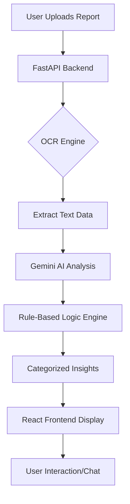

# Lab-Lens: AI-Powered Medical Report Analysis Tool
Developed by **Shounak Shelke**

Lab-Lens is an AI-powered medical report analysis tool built to make complex lab reports easier to understand for everyday users.

## Standout Project: Lab-Lens

One of my standout projects is **Lab-Lens**, an AI-powered medical report analysis tool that I built to make complex lab reports easier to understand for everyday users.

### Problem
Most patients struggle to interpret medical reports filled with technical jargon and numerical values. This leads to anxiety, confusion, and sometimes even medical mismanagement before they can consult a specialist.

### Solution
Lab-Lens addresses this by using OCR to extract data from reports and combining it with AI (LLMs like Gemini) and rule-based medical logic to generate simple, human-friendly explanations.

The system not only explains lab values in plain language but also:
*   **Highlights abnormal results** with severity levels.
*   **Provides contextual insights** based on common medical knowledge.
*   **Suggests specialist consultation** (e.g., "See a Hematologist") without giving clinical diagnoses.

---

## Sample Screenshots

| Dashboard Homepage | User Report Uploading | User Report Results Page |
|:---:|:---:|:---:|
|  |  |  |

| User Ask Assistant about Report | Admin Prompt & Safety Monitor | Admin Disclaimer/Rules |
|:---:|:---:|:---:|
|  |  |  |

---

## Architecture Diagram

## Technical Depth
*   **Frontend**: React, TypeScript, Tailwind CSS, Shadcn UI
*   **Backend**: Python, FastAPI
*   **AI/ML**: Google Gemini 1.5 Flash, EasyOCR
*   **Safety**: Structured medical rules + AI-based safety monitoring

### Core Challenges & Solutions
1.  **Ensuring Accuracy & Safety**: One of the biggest challenges was ensuring that the outputs were accurate yet safe (non-diagnostic). I solved this by combining AI responses with structured medical rules, improving reliability and user trust.
2.  **OCR Noise Handling**: Medical reports often have complex layouts. I optimized the text extraction pipeline to handle noise and ensure critical numerical values were captured correctly.

---

## Sample Input/Output

**Sample Input (Image/PDF):**
- Hemoglobin: 10.5 g/dL
- WBC Count: 14,000 /uL

**Lab-Lens Output:**
- **Status**: Abnormal - Moderate Risk
- **Explanation**: Your hemoglobin is slightly below the normal range, which might indicate mild anemia. Your white blood cell count is elevated, which often suggests your body is responding to an infection or inflammation.
- **Suggested Specialist**: General Physician or Hematologist.

---

Built with Love: **This is a Part of Project Cortex LMH developed by Shounak Shelke** 🧡
